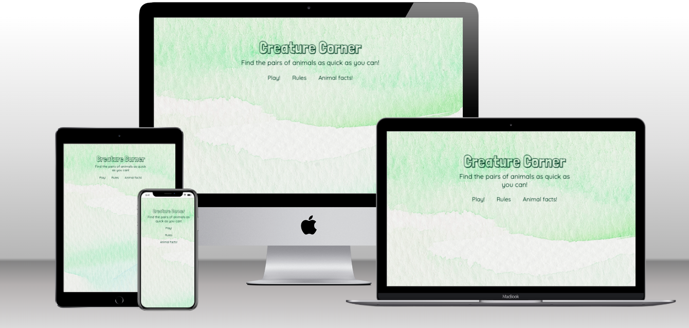
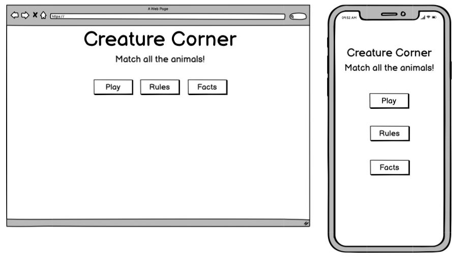
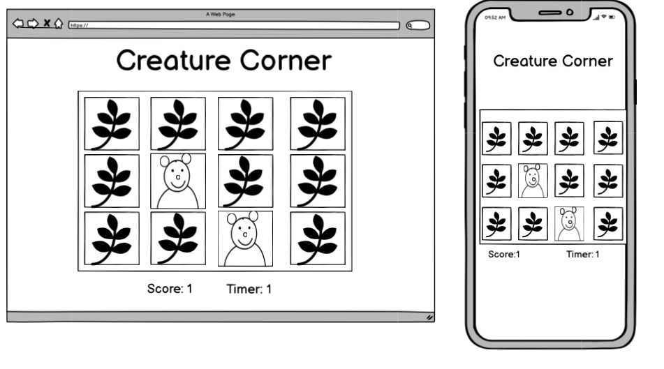
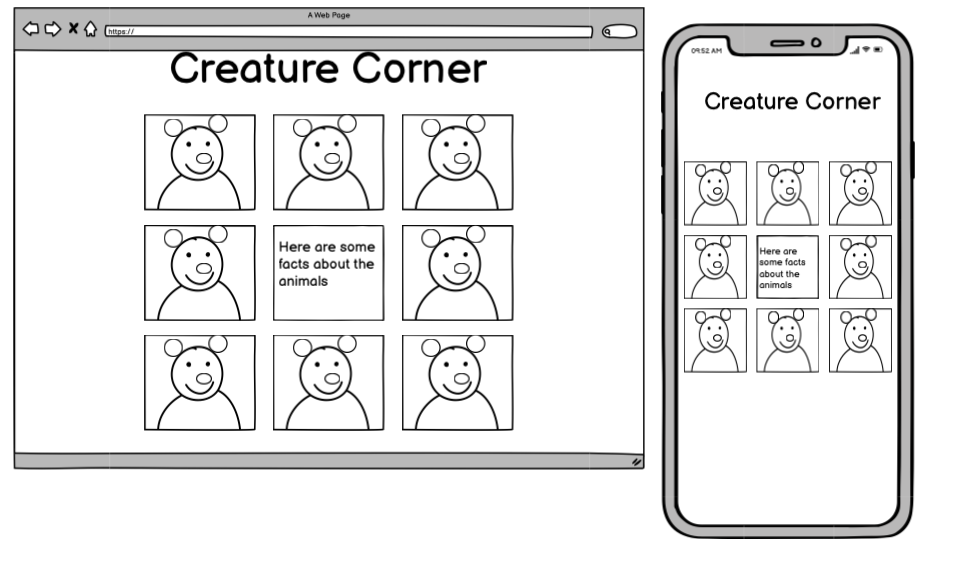
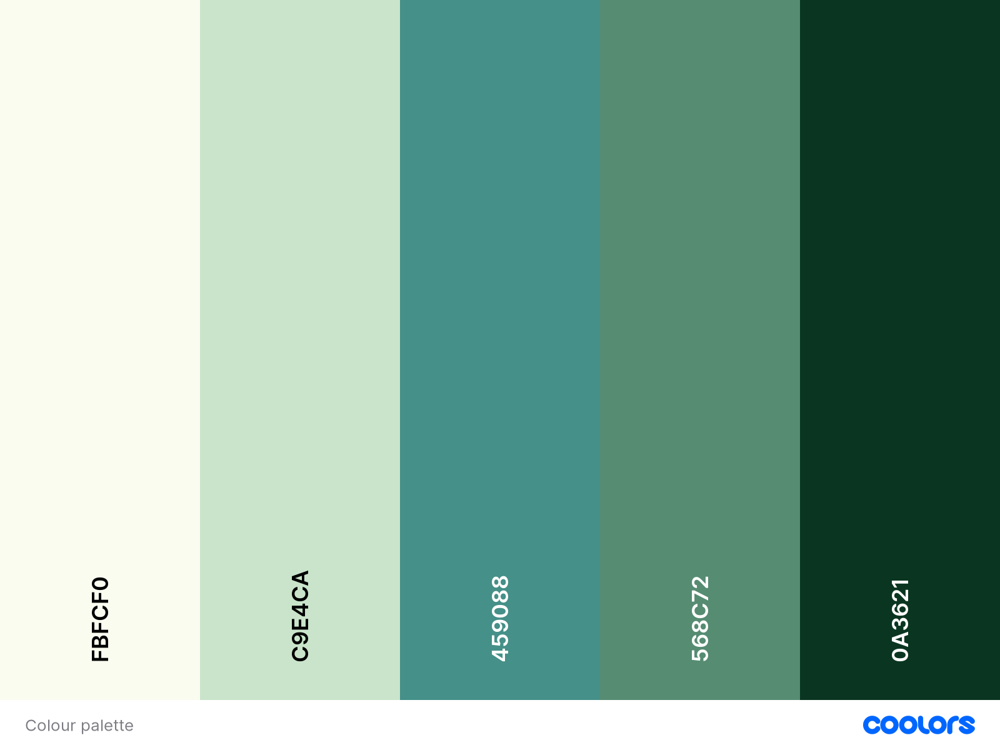

# Creature Corner

[Link to live website](https://bethanyalicehall.github.io/memory-final/)

---

## About
**Milestone 2 project - Interactive Frontend Development - Code institute**

Creature Corner is a website for animal lovers, incorporating a memory matching game and some interactive fun fact cards.

---

## Table of Contents
- [User experience (UX)](#ux)     
    - [User stories](#user-stories)
    - [Strategy](#strategy)
    - [Scope](#scope)
    - [Structure](#structure)
    - [Skeleton](#skeleton)
    - [Surface](#surface)
- [Features](#features)
- [Technologies used](#technologies-used)
- [Testing](#testing)
- [Deployment](#deployment)
- [Credits](#credits)

---

## UX
User experience

### User stories
#### As a new user I want ...
- A fun, colourful, quick game
- To learn how to play quickly, with straightforward, clear rules
- To learn interesting facts about a wide range of animals.

#### As a returning user I want ...
- The game to change each time so that there is a new order of cards each time.
- To be able to see my stats while playing the game, so I can challenge myself each time
- A website that is easy to use and works well on mobile, tablet, and desktop.

#### As the business owner I want ...
- To create a game that both children and adults can enjoy
- To increase visits to the website, and gain returning users.

---

### Strategy
The following questions were asked when developing a strategy...
- Who is the target audience, and is it culturally appropriate?
    - The target audience is anyone who is interested in animals! For the game young children could play along with help from their parents/guardians, older children and adults will enjoy the game too! The facts page is more suitable for anyone who is able to read and wants to learn some unusual facts.
- Is the technology appropriate for the user and the purpose of the website?
    - The strategy for the technology is simplicity, so that the game can be used by all ages and players will want to return to the site
- How is the offering of this site different from competitors?
    - It provides a playful game element to the site, but also an educational side with the animal facts.

From the above questions, the focus for the strategy will be on the following:
- Make the different options of the site accessible from the home page
- Develop a game that all ages will enjoy
- Increase return players back to the site, by providing stats and a more challenging level.

---

### Scope
The scope of this website is to provide...
- Straightforward navigation around the site
- Interesting and factually correct information about a variety of animals
- A simple yet entertaining memory card game, featuring animals
- Clear rules for the game provided on the home page prior to playing the game

---

### Structure
The website is organised by a hierarchical tree structure. This is a standard structure used commonly, and it reduces complexity. This structure can sometimes provide problems in regards to the navigation bar when displayed on mobile devices, however including the burger toggle bar, solves this.

It is made up of 4 pages
- A home page - introducing the name of the site, a link to the rules, as well as a link to the game and the facts page.
- Two games pages
    - Level 1 - A 3x4 grid of cards and a timer and move counter above the board
    - Level 2 - A 5x4 grid of cards and a timer and move counter above the board
- A fact page - A grid of 12 cards each featuring an image of a different animal and on the flip side of this card is the name of the animal and a fact

---

### Skeleton

- Each page features the website name "Creature Corner" at the top centre of the page
- I considered the responsive layout and how it would be viewed on tablet and mobile devices as well as on desktop. 
- Padding and margins were used throughout to ensure that the content sits centrally and everything is separated appropriately

#### Wireframes

The original wireframes differ slightly to the final layout of the website, this is because as I was developing the site naturally some changes occurred that seemed logical to improve UX.

 

Changes made throughout development
- Initially I had planned to have an image on the back of the cards in the game however I thought to make it clear as to when they were flipped over or not it was better to have a bold colour instead.
- I had planned to have the timer below the game board however due to scaling this would mean it may be off screen and not visible so I changed that to sit above the board.
- I added an extra row of three fact cards

---

### Surface

#### Colour

- #FBFCF0 - the background colour for the front of the game cards and the text within the fact cards
- #C9E4CA - the game board background colour and colour of some buttons 
- #459088 - the background colour of the backs of the playing cards, some of the fact cards and also the colour of the hover over the links
- #568C72 - the background of some buttons and some of the fact cards
- #0A3621 - the text colour for most of the text throughout the website

I chose these colours as the green and blue colours reminded me of nature and I thought that linked quite well to the main focus which is animals. I didn't want anything too over the top so kept it quite muted, and then the emojis within the game brought more of a splash of colour. 

#### Imagery

I chose carefully which images to include for the facts page. I thought each image had a slight comical aspect to it and certainly showed the character of the animals. I thought that the user would enjoy browsing through these images.

For the Favicon I chose a frog image, as of course it is an animal and it fits well with the green theme throughout.

The background image is a green textured image which reminded me of leaves, which I thought was quite apt

Click [here](media-sources.md) to see details of images used throughout the site.
 

#### Typography and icons

I used Google fonts for all of the fonts;

- 'Londrina Shadow' - cursive 
    - This was the font used for the main title and other sections of text I wanted to stand out. Again I thought this font had character and was quite fun, so works well on the themes of animals/games.

- 'Quicksand', sans-serif 
    - This was used as the main font throughout the site within the body

---

## Features

### Game boards
Level 1 and level 2 feature game boards containing 12/20 cards respectivley, a timer, a moves counter, a button to start the timer and a link to the home page.
- The timer goes up and stops when all the pairs have been found.
- The moves counter increments each time a card is turned over.
- The game boards are responsive to support use of different devices

### Win message
When the player succesfully matches all of the cards on the board, the board flips over and a win message appears.
- The stats for that game are displayed.
- An option to play level 1 again or try level 2 are presented.

### Fact Cards
Interactive fact cards that have a high quality animal image on one side and the name of the animal and a fact on the other side, the user can click between each side to learn facts about each animal. The cards sit 3x4 on desktop but are responsive and shrink down to one column on most mobile devices.

### Interactive links
All of the links have added hover styling and the pointer changes to indicate that they are links to the user

### Accessibility
- Alt attributes have been added to all images 
- Text size, font and colour were considered in a way to hopefully provide clear, easy reading.
- Wave was used to carry out testing which looked at accessibility, see [Testing](#testing) section. 

### Meta data
Meta tags are included within the head element, including a description, the author and keywords, to improve search engine optimisation. 

### 404 error page 
A custom 404 error page was added, including a link to redirect back to the home page.

### Future features to consider

#### Style change on correct match of cards
As suggested in my feedback from family and friends, it could be a good feature to add to change the colours of the cards when a correct match is found, just to add some further interactivity to the game. This shouldn't be too complex to add in as there is already a function that checks if the two cards match, and makes the cards stay fixed and not flip back over. 

#### A table to store your scores in
To add to the competitive side to the game I think it would be good to add in a feature where you can input your name and then your score would be saved so you could play against others.

#### Further levels of the game 
Maybe up to 5 levels would draw more players to return to the site, and it is a way to add a more challenging element to the site.

#### Themed levels
Each game level could have a different theme, grouping animals together, e.g jungle, underwater, farm etc.

---

## Technologies used

### Languages
- [HTML5](https://en.wikipedia.org/wiki/HTML5) - a markup language used for presenting and structuring content.
- [CSS3](https://en.wikipedia.org/wiki/CSS) - stylesheet language for adding style.
- [JavaScript](https://en.wikipedia.org/wiki/JavaScript) - language used to created dynamic and interactive programmes

### Programs and websites
- [GitHub](https://github.com/) - to host the repository, and then deploy to GitHub pages.
- [GitPod](https://gitpod.io) - to write the code and use GIT to commit and push to GitHub.
- [Balsamiq](https://balsamiq.com/) - used to produce the wireframes.
- [Coolors](https://coolors.co/) - used to create a colour palette for the website.
- [Techsini](https://techsini.com/multi-mockup/index.php) - used to create the multi device mockup.
- [W3C HTML Validation service](https://validator.w3.org/) - used to validate HTML
- [W3C Jigsaw CSS Validation service](https://jigsaw.w3.org/css-validator/) - used to validate CSS
- [JS Lint](https://www.jslint.com) and [JSHint](https://jshint.com/) - used to check the JS
- [Lighthouse](https://developer.chrome.com/docs/lighthouse/overview/) - for performance testing.
- [Wave](https://wave.webaim.org/) - for accessibility testing.
- [Chrome developer tools](https://developer.chrome.com/docs/devtools/) - for testing responsiveness throughout.

### Frameworks and Libraries 
- [Bootstrap](https://getbootstrap.com/) - version 5.2 was used for the homepage and the fact page. Bootstrap documentation was used specifically for the rules modal within the homepage, and aided with repsonsiveness on these pages. 
- [Google Fonts](https://fonts.google.com/) - Selected a variety of fonts and imported these into the code. 
- [Image resizer](https://imageresizer.com/) - Used to resize all fact card images to be equal in size.

---

## Testing 
Click [here](testing.md) to view all testing carried out.

---

## Deployment

### Steps taken to deploy project to GitHub Pages
1. Go to **My repositories**.
2. Select **bethanyalicehall/memory-final**.
3. At the top of the page click on **Settings**.
4. Scroll down and on the left hand side there is a **Pages** section.
5. Under **Source** click the drop down menu and select **Main**.
6. Click **Save**, the website will now be deployed (note it can take a minute or two to load).

### Access to code
1. Go to **My repositories**.
2. Select **bethanyalicehall/memory-final**.
3. At the top of the page click on **Code**, where **Zip files** can be downloaded locally.

---

## Credits 

### Media
- [Unsplash](https://unsplash.com/) - this was used for the images of animals for the fact cards
- [Raw Pixel](https://www.rawpixel.com/) - The background image was sourced from this site
Click [here](media-sources.md) to see details of images used.

### Content
- [Code institute boiler template](https://github.com/Code-Institute-Org/gitpod-full-template) was used.
- Code was taken from bootstrap documentation and edited to suit this project for the rules modal on the home page 
- Code with inspiration and help from the following
    - [A designer who codes - Responsive background images with Bootstrap 5](https://www.youtube.com/watch?v=W87XNjvXiWw&t=18s) 
    - [Traversy media - Bootstrap 5 video](https://www.youtube.com/watch?v=4sosXZsdy-s)
    - [W3 Schools](https://www.w3schools.com/)
    - [Code institute](https://codeinstitute.net/) projects, in particular the Love Running project.
    - [cntraveller](https://www.cntraveller.com/gallery/happiest-countries-in-the-world) - information about the happiest countries in the world
    - [The broke backpacker](https://www.thebrokebackpacker.com/backpacker-statistics/) - website used for statistics
  

### Acknowledgements
I would like to thank
- Code institute tutors - particularly Sean, Ed, Rebecca, and Scott - they helped me out of some sticky situations!
- Pasquale Fasulo my college supervisor.
- The photographers who publish royalty free images on Unsplash and Raw Pixel that allowed me to use high quality imagery throughout.
- All of the code institute team, for providing quality learning content to allow me to develop my skills to complete this project.

---
