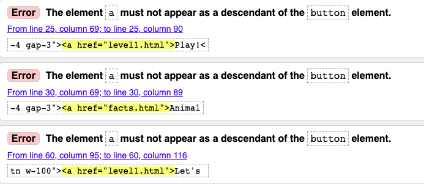
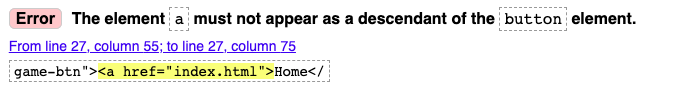
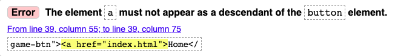
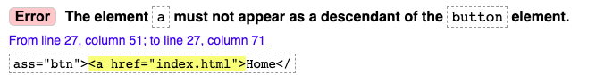
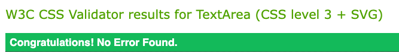
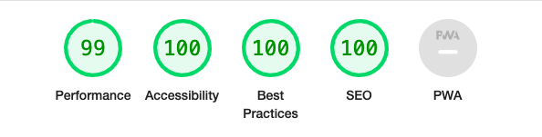
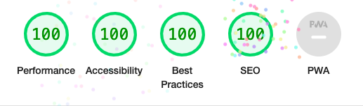
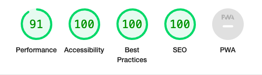
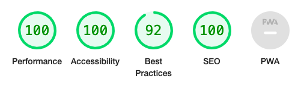

# Testing

## HTML validator
I inputted my HTML into the W3C Markup Validation service.

### Home page

- For error 1, I replaced the name attribute with an id attribute.
- For error 2, this was the only way I found in providing textual context to the background image as the image itself was within CSS. I removed this as the image is not providing any information to the user. 
- For error 3 and 4 I changed the buttons to links.

### Level 1

- For error 1, I replaced the name attribute with an id attribute.
- For error 2, this was the only way I found in providing textual context to the background image as the image itself was within CSS. I removed this as the image is not providing any information to the user. 
- For error 3-6, I removed the id attributes as they were not needed, as there was already a class attribute.

### Level 2

- 

### Fun Facts

- For error 1, I replaced the name attribute with an id attribute.
- For error 2, this was the only way I found in providing textual context to the background image as the image itself was within CSS. I removed this as the image is not providing any information to the user. 
- For error 3 and 4 I removed the br elements within the unordered list.

I corrected each error and re-checked the HTML through the validator, and it passed.

## CSS validator
I inputted code into the W3C validation service, initially this brought up one error
- I had inputted text-align: right; and it said that this was not a property for text-align, however this was left in by mistake so I took this out of the code which had no impact on my deployed site.

## Performance testing
I utilised the [Lighthouse](https://developer.chrome.com/docs/lighthouse/overview/) performance testing software.
- The results of the lighthouse testing can be seen below for each page. 
- 
### Home page

### Level 1 page

### Level 2 page

### Fun Facts page

## Accessibility testing
I utilised [Wave](https://wave.webaim.org/) which is a web accessibility evaluation tool.

- One error was dected, there was a paragraph, that the tool detected as looking like a heading so I changed that to an h2 element, from a paragraph element.
- Some contrast errors were picked up on the buttons on the level 1 and 2 pages, I changed the text from an ivory colour to a dark green colour.
- Some contrast errors were also acknowledged in the facts page, however they did still pass teh large text test and the text was large so it was ok.

## Responsiveness
- I utilised Chrome Developer tools to test responsiveness on different devices, the following devices were sucesfully tested through this.
    - iPhone SE
    - iPhone XR
    - iPhone 6/7/8
    - Samsung galaxy S8+
    - iPad Mini
    - Surface pro 7
    - Galaxy Fold
    - Nest Hub

- I manually tested the website on an iPhone 12 pro, an iPad 2 and a MacBook Air.

## Manual testing

### Functional testing

Each of the following tests were carried out on a Macbook Air and an iPhone 12 pro.

| Page | Element and expected action | Pass or Fail | 
| ----------- | ----------- | ----------- |
| All pages | There is a multi-toned green background | Pass |
| All Pages | When hovering over a link the pointer changes and there is a colour change to indicate interactivity | Pass |
| Home page | url linked in README.md displays Creature Corner homepage, and the frog Favicon is visbile | Pass |
| Home page | There is a main title and a subtitle, giving more information about purpose of site | Pass |
| Home page | The Play link takes you to level 1 of the memory game | Pass |
| Home page | The Rules link opens up a modal explaining the rules| Pass |
| Home page | Within the modal there are clear rules and a link to level 1 to start playing and a button to exit the modal | Pass |
| Home page | The Animal facts link takes you to the facts page| Pass |
| Level 1 and Level 2 | The game board fits centrally within the screen| Pass |
| Level 1 and Level 2| The button to start the game, starts the timer for the game | Pass |
| Level 1 and Level 2| The link back to the home page takes you to the home page| Pass |
| Level 1 and Level 2| The timer and the moves counter work correctly| Pass |
| Level 1 and Level 2| Each card starts face down| Pass |
| Level 1 and Level 2| Each card turns over when clicked on adn you can only turn 2 cards over at the same time| Pass |
| Level 1 and Level 2| If two cards do not match they will go facedown | Pass |
| Level 1 and Level 2| If two cards do match they will stay face up | Pass |
| Level 1 and Level 2| Once all of the cards are face up the game ends and a winning message appears | Pass |
| Level 1 and Level 2| Within the winning text, information is provided on the users game stats including how many moves they have made and the time they took | Pass |
| Level 1 and Level 2| Within the winning text there is a link to play again on level 1 and this takes you to the game area again | Pass |
| Level 1 and Level 2| Within the winning text there is a link to play level 2 and this takes you to the level 2 page | Pass |
| Facts page | The main website name, a title and a subtitle are presented at the top of the page, providing some more information about what this page is about | Pass |
| Facts page | There is a link back to the home page which works | Pass |
| Facts page | There are 12 colourful square images of animals | Pass |
| Facts page | When you click on any animal the card flips and the name of the animal and a fact is displayed about the correct animal | Pass |
| Facts page | When you click on the fact the card will again flip and the animal will be displayed | Pass |

### Browser compatibility
The following browsers were used to check compatibility with the website
- Chrome
- Safari
- Microsoft Edge

## Testing User Stories

### As a new user I want ...
- The purpose of the website to be clear.
    - The first section of text underneath the hero image explains what the company is all about

- To easily navigate the website, to learn more about travelling around Europe.
    - Clear navigation bar that links to route page with information about where you can travel in Europe.

- To find readily available information about the business and have clear contact options if I want to find out more.
    - There is a form to get in touch and social media links within the footer

### As a returning user I want ...
- Inspiring imagery and information to give me ideas for my next trip I will book through the website.
    - Hero images are eye catching and the route cards contain short but interesting sections of information alongside a carousel of images.

- A website that is easy to use and works well on mobile, tablet, and desktop.
    - The website has been fully tested and is responsive on all device sizes.

### As the business owner I want ...
- To increase awareness of the business.
    - Key words have been included within the meta tags to allow for search engine optimisation.
- To increase trip planning requests to allow the business to grow financially.
    - There is an extra link on the home page taking the user directly to the form, to encourage requests.

- To increase the businesses social media presence.
    - There is a dedicated section to the Routes of Europe Facebook group, as well social media links within the footer. 

## Identified bugs

- Bug: On the routes page I noticed that when clicking left or right on the second or third carousel it was controlling the first and not the one that was being clicked.
    - How I fixed it: I realised that each carousel had the same id as I had copied and pasted without realising, once this was corrected the error was solved.

- Bug: The text on the get in touch page, explaining the next steps, when viewed on a mobile device was slightly off centre to the right.
    - How I fixed it: I changed the text from an unordered list with list items, to individual paragraphs, and this allowed the text to be aligned to the centre.

- Bug: When viewed on smaller screen sizes the carousel images appeared unequal in size.
    - How I fixed it: I used an image resizer to make sure images had the same dimensions.

- Unfixed bug - when first loading the page the pin drop icon that is part of the logo, it appears as text for a second before changing to the icon.